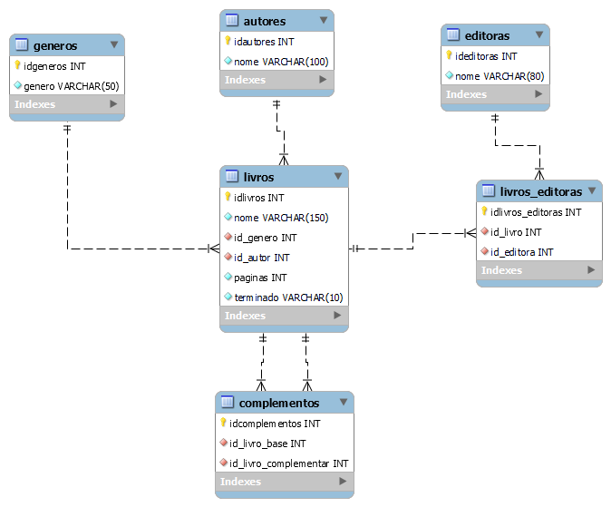

# BIBLIOTECA PESSOAL

    Bem vindo a minha biblioteca pessoal!

Esta biblioteca pessoal se trata de uma aplicação CRUD simples 
utilizando Python e SQLite para armazenar as principais 
informações sobre os meus livros.

O banco de dados foi modelado utilizando o MySQL Workbench e
possui a seguinte forma:

    

Com a modelagem, os comandos SQL foram utilizados no módulo
database.py para gerar as tabelas.

------------------------------
Contato:
-
[LinkedIn](https://www.linkedin.com/in/rodolpho-kades/)

[GitHub](https://github.com/rodskades)

<rodolpho_kades@hotmail.com>